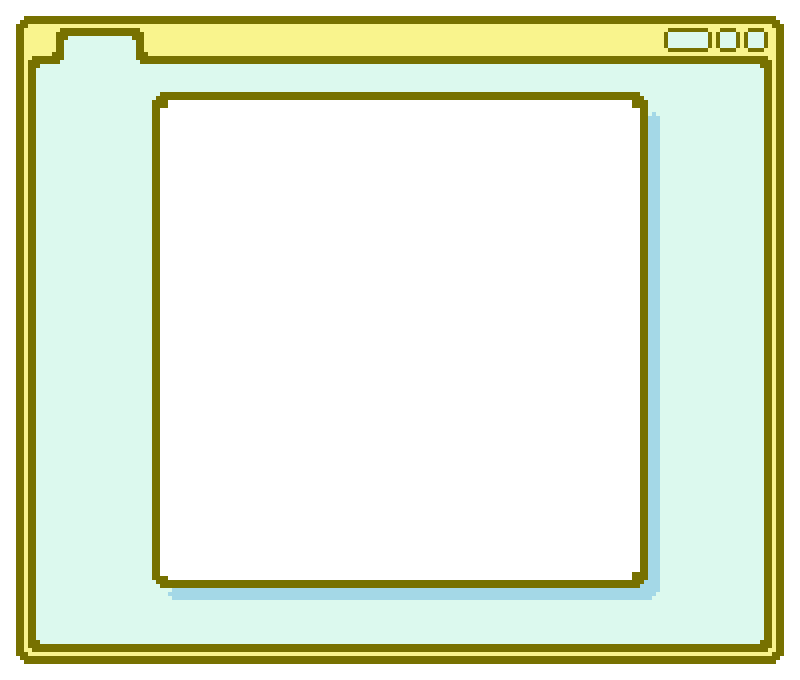
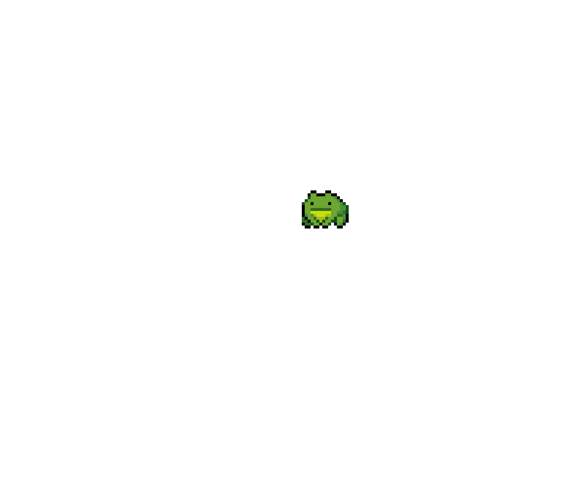
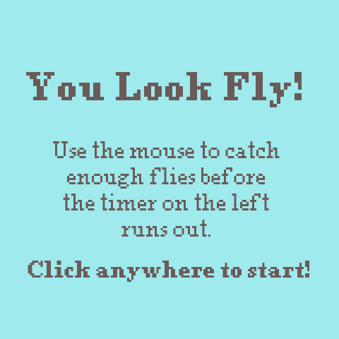

# You Look Fly!

Norah Wilcox

[View this project online](https://norahwilcox.github.io/CART253/topics/mod-jam/)

## Description

> "You Look Fly!" is a cute point and click game that allow the player to catch flies as a little frog sitting on a rock.

> The experience is controlled via the mouse, with left click controlling the frog's tongue movement.

> The game is timed on the left side of the screen. When the timer runs out, the player loses. To win, the player must catch enough flies using the frog's tongue to fill up the counter on the right side of the screen.

## Screenshot(s)

> 

> (./assets/images/frog-mouth-open.png)

> 

> 

## Attribution

> - This project uses [p5.js](https://p5js.org).

> - This project's pixel art graphics were created using Aseprite (https://www.aseprite.org).

> - The "miss" sound effect is from Flipnote Studio on DS / DSI found here: https://sounds.spriters-resource.com/ds_dsi/flipnotestudio/asset/422126/ named "Sample 1.wav."

> - The "yom" sound effect is from Animal Crossing: Pocket Camp on mobile found here: https://sounds.spriters-resource.com/mobile/animalcrossingpocketcamp/asset/410558/ named "Gal_404-4.mk.16.cn4.wav."

> - The music used is from Wii Play Motion 2011 found here: https://downloads.khinsider.com/game-soundtracks/album/wii-play-motion-wii named " Staff Credits."
