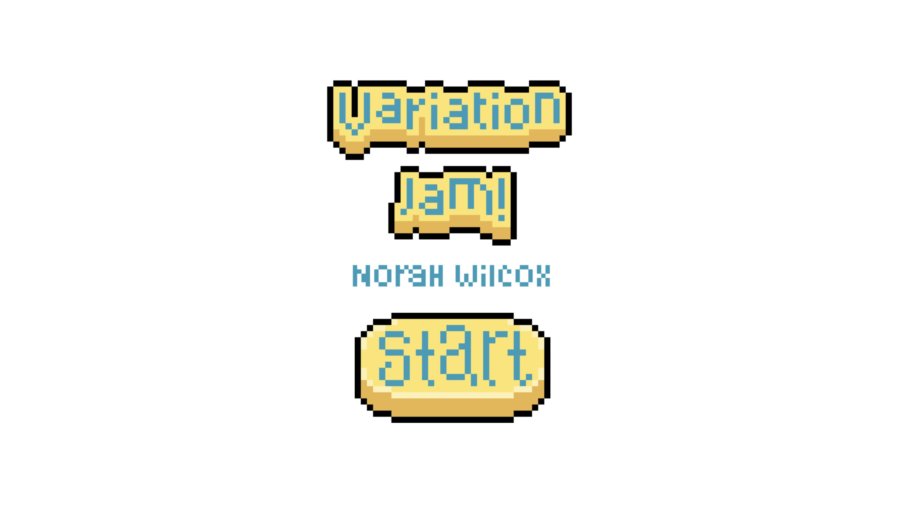
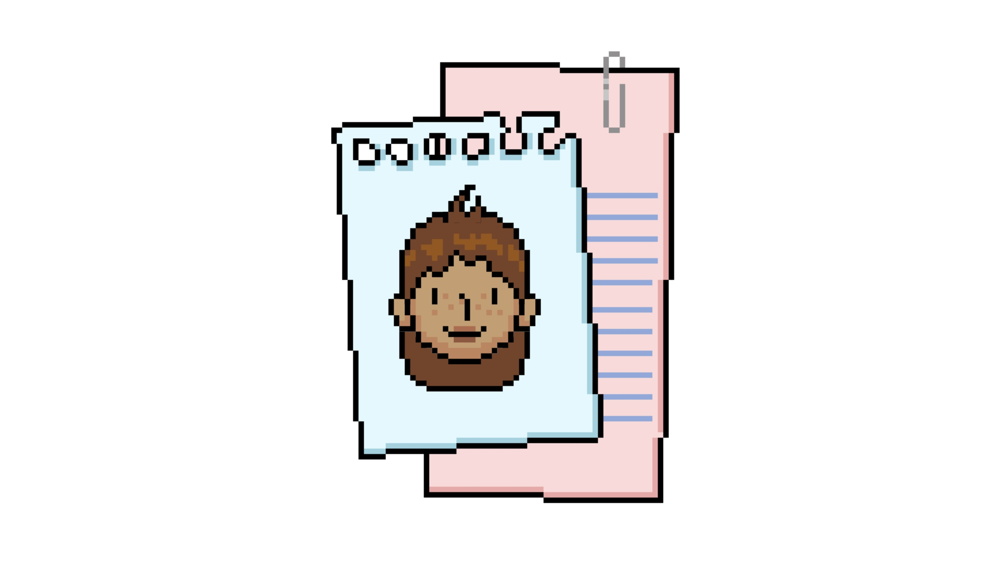
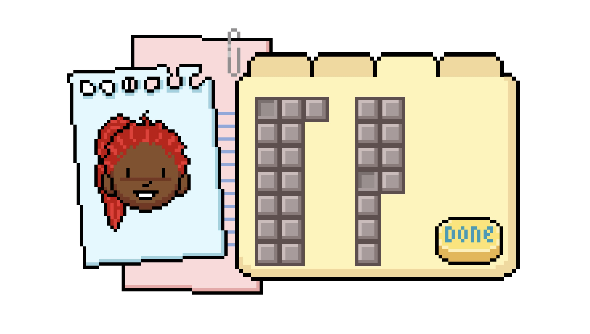

# TITLE OF PROJECT

Norah Wilcox

View this project online: https://norahwilcox.github.io/CART253/topics/variation-jam/

## Description

> Variation Jam! is a cute pixel art character creator inspired by childhood character customization games on flash.

> The experience is controlled completely via the mouse, using left click to press buttons which customize your character however you please.

> Use the tabs above the folder to navigate which elements you would like to change and click the "done" button once your little guy is finished!

## Screenshot(s)

> 

> 

> 

## Attribution

> - This project uses [p5.js](https://p5js.org).

> - This project's pixel art graphics were created using Aseprite (https://www.aseprite.org).

> - The "allDone" sound used is by Universfield from pixabay.com: https://pixabay.com/sound-effects/happy-message-ping-351298/

> - The "click" sound used is by floraphonic from pixabay.com: https://pixabay.com/sound-effects/ui-pop-up-3-197888/

> - The "pick" sound used is by 47313572 from pixabay.com: https://pixabay.com/sound-effects/ui-sounds-pack-3-11-359714/
